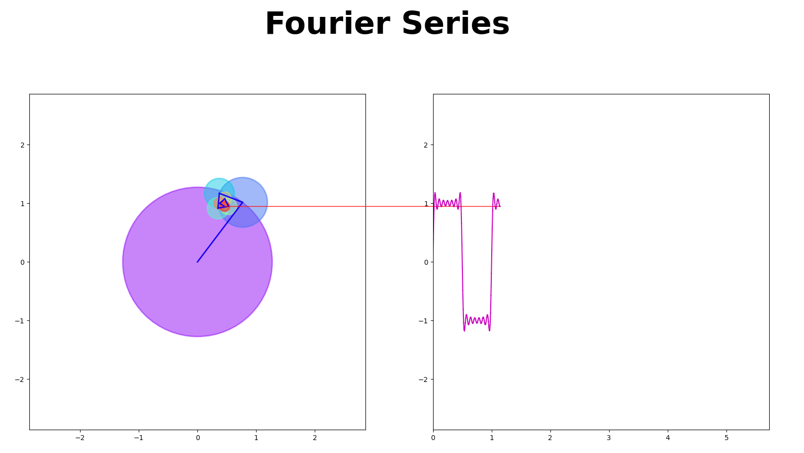

### DSP-Fourier-Transform-Visualiser
This is the simple GUI for display DFT with parameterizable inputs with python gui. With this repository you can visualise fourier equations with coordinate plane.

### Usage
- git clone ...
- cd dsp-fourier-transform
- python -m venv venv
- Windows: ```.\venv\Scripts\activate```
- Linux: ```source ./venv/bin/activate```
- pip install -r requirements.txt
- python app.py
- Enjoy!  


### GUI  
